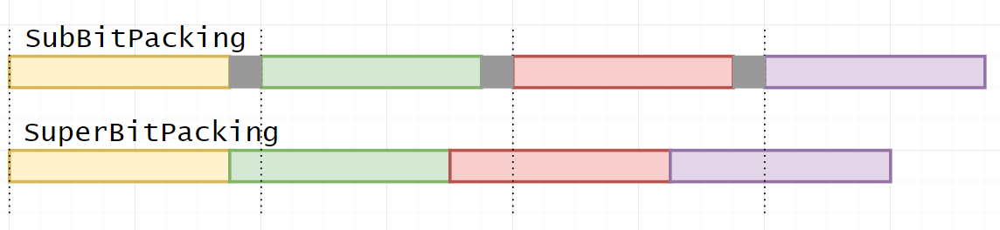

# Sub-Bit Packing


## Table Of Contents

- [Sub-Bit Packing](#sub-bit-packing)
  - [Table Of Contents](#table-of-contents)
  - [TL;DR](#tldr)
  - [Summary](#summary)
  - [The Problem With Storing States](#the-problem-with-storing-states)
    - [Bitwise State Packing](#bitwise-state-packing)
    - [Sub-Bit State Packing](#sub-bit-state-packing)
  - [How Does It Work?](#how-does-it-work)
  - [Space Saved](#space-saved)
  - [Saving Even More Space](#saving-even-more-space)
  - [Packed State Arrays](#packed-state-arrays)
    - [BitPackedArray](#bitpackedarray)
    - [SubBitPackedArray](#subbitpackedarray)
    - [SuperBitPackedArray](#superbitpackedarray)
  - [Comparing Arrays](#comparing-arrays)
  - [SubBitPacked Structs](#subbitpacked-structs)
    - [Underlying Mathematics](#underlying-mathematics)
- [How To Use](#how-to-use)
  - [BitPacked-, SubBitPacked- \& SuperBitPacked Arrays](#bitpacked--subbitpacked---superbitpacked-arrays)
    - [Initialization](#initialization)
    - [Set Values](#set-values)
    - [Retrieve Values](#retrieve-values)
    - [Getting The Actual Amount Of Used Memory In Bytes](#getting-the-actual-amount-of-used-memory-in-bytes)
  - [SubBitPackedStruct](#subbitpackedstruct)
  - [Exceptions](#exceptions)

## TL;DR

A library to store state values in a memory efficient way using sub-bit compression.

## Summary

Storing states bitwise can lead to huge amounts of wasted memory. This library aims to save memory by packing values arithmetically. [This table](#space-saved) lists the amount of saved space when comparing arithmetically packed values and bit-packed values.
The drawback is a runtime overhead for setting/retrieving the values because calculations need to be done instead of simple addressing.
Therefore, if the number of states you want to store has no spacial benefit (e.g. powers of 2) you should stick to bitwise packing because of the faster runtime.
On the other hand, you can fit more values of states that can be tightly packed together on platforms where memory is the limiting factor (e.g. embedded systems) utilizing this library.

## The Problem With Storing States

```c++
    enum class MyState: uint8_t
    {
        First,
        Second,
        Third,
    };

    MyState a_lot_of_states[10000];
```

`sizeof(MyState)` will give you 1 byte

`sizeof(a_lot_of_states)` will, therefore, give you 10000

In order to store 10000 values we are using 10000 bytes or 80000 bits which could store up to $$2^{(10000 * 8)} = 2^{80000} \approx 10^{24000} $$ binary states  - but we only need $$3^{10000} \approx 10^{4771} $$ states.

This naive method to store states is a huge waste of memory.

### Bitwise State Packing

The first step to mitigate wasting memory is to store the states in the least amount of bits necessary.
To store three states, we need a maximum of 2 bits.

So to store 10000 states we would only need 20000 bits or 2500 bytes.

We can already save 75% of storage (10000 vs. 2500) with this method.

### Sub-Bit State Packing

The above method works perfectly fine if the number of states a value can represent can make use of the bits it is stored in. But there is still wasted memory if that is not the case.
As you may have already figured out, when using 2 bits to represent 3 states, there is one extra unused state:

`00` First

`01` Second

`10` Third

`11` _unused_

When storing many values, we can save 25% memory here by not storing the values bit-packed but arithmetically-packed instead. This way, even the _unused_ state will be used to hold information.

## How Does It Work?

Internally the values are held in an array of 32-bit data chunks. Instead of bitwise packing, however, a form of [arithmetic coding](https://en.wikipedia.org/wiki/Arithmetic_coding) is used to store the values. The advantage of this is that you can pack (the same or) more values in a given data buffer than with traditional bitwise packing. The overall space saved for values with $n$ different states can be calculated with the following formula:

$$ factor = {\lfloor {32 \div \log_2(n)  }\rfloor \over \lfloor {32 \div \lceil \log_2(n) \rceil } \rfloor} $$

Lets say you want to store values with `3` different states:

$$ factor = {\lfloor {32 \div \log_2(3)  }\rfloor \over \lfloor {32 \div \lceil \log_2(3) \rceil } \rfloor} = 1.25$$

This means an arithmetically packed buffer will be able to store 25% more values than with traditional packing. See [this table](#space-saved) for more values.

## Space Saved

Here's a table for values with different number of states and how much space is saved compared to bitwise packing. Both done in 32-bit words:

| Number of states per value  | Space advantage |
| -- | ------ |
|3 | 25%|
|5 | 30%|
|6 | 20%|
|7 | 10%|
|9 | 25%|
|10,11 | 12.5%|
|17-23 | 16.66%|
|33-40 | 20%|
|65-84 | 25%|
|1025-1625 | 50%|

The space saved for all other values is 0%. That means it is not better nor worse than bitwise packing. However, the access times are slower. Therefore, sub-bit-packing is not optimal for such use cases.

## Saving Even More Space

Lets say you want to store $n$ number of states.
The formula to find out how many values can be stored in a sub-bit-packed 32-bit word is:

$$ {32 \over \log_2(n)} $$

Filling in `5` we get something like 13,78.. meaning that every 32-bit word wastes around 0.78 state values. We can calculate the number of wasted (whole) bits per 32-bit word using this formula:

$$ {\lfloor \left({32 \over \log_2(n)} - \lfloor {32 \over \log_2(n)} \rfloor \right)\cdot {\log_2(n) }  \rfloor} $$

Again, filling in `5` gets us 1, meaning there is 1 bit in every 32-bit word that goes unused. (For a higher number of states, the number of unused bits per word can even go as high as 10)

Saving memory in these cases is as easy as shifting the 32-bit sub-bit-packed words closer together for the amount of unused bits. This library refers to this technique as `SuperBitPacking`. Here is a visual comparison to `SubBitPacking`:



The drawback here is an additional access overhead because the values need to be shifted before they can be accessed to do the normal `SubBitPacking` calculation.

## Packed State Arrays

This library provides several types of arrays to store state values in. Internally, each array holds an array of `uint32_t`. They only differ in the level of compression. The following listings are in order of memory usage (high to low) and access time (fast to slow).

### BitPackedArray

Stores values as described [here](#bitwise-state-packing). If the number of bits needed to store states does not evenly devide 32, some values are stored across two 32-bit words. When accessed, these words are shifted accordingly to get/set values. This is done to prevent wasting bits.

### SubBitPackedArray

Stores values as described [here](#sub-bit-packing). Slower than [BitPackedArray](#bitpackedarray) but [saves memory](#space-saved).

### SuperBitPackedArray

Stores values as described [here](#saving-even-more-space). If the number of unused bits per 32-bit word is `0` then this array behaves exactly as [SubBitPackedArray](#subbitpackedarray). If the number of unused bits is `> 0`, the access times are slower than [SubBitPackedArray](#subbitpackedarray) but the space saved is even greater.

## Comparing Arrays

The following results stem from running [Code](https://gist.github.com/ChristianAmannKT/55a690f825bb68701a3b87d2782b7ce6) on an [ESP32](https://en.wikipedia.org/wiki/ESP32). The code was built with `-Os` optimization. Each array holds 100,000 values and was read from and written to 10,000,000 times. Here are a few different number of states and the correlating benchmark results:

`3 States`
| Array | Bytes used for 100,000 values | 10,000,000 write/read times (ms) |
| -- | -- | -- |
| BitPackedArray | 25000 | 3485 |
| SubBitPackedArray | 20000 | 5789 |
| SuperBitPackedArray | 20000  | 5789 |

`12 States`
| Array | Bytes used for 100,000 values | 10,000,000 write/read times (ms) |
| -- | -- | -- |
| BitPackedArray | 50000 | 3443 |
| SubBitPackedArray | 50000 | 5239 |
| SuperBitPackedArray | 45316  | 10174 |

`17 States`
| Array | Bytes used for 100,000 values | 10,000,000 write/read times (ms) |
| -- | -- | -- |
| BitPackedArray | 62500 | 3967 |
| SubBitPackedArray | 57144 | 5955 |
| SuperBitPackedArray | 51788  | 10640 |

## SubBitPacked Structs

Additionally to the packing of homogeneous state values, this library provides a way to store multiple values with different number of states in a single struct. This is called a `SubBitPackedStruct`. The underlying arithmetic is similar to how [Sub-Bit State Packing](#sub-bit-state-packing) works. Look [here](#underlying-mathematics) for how this works.

It is also possible to store multiple `SubBitPackedStructs` loosely in a `SubBitPackedStructArray` or tightly packed in a `SuperBitPackedStructArray`. See [SubBitPackedStruct](#subbitpackedstruct) for how to do this.

### Underlying Mathematics

The value of `SubBitPackedArray` entries for values $a_i$ with $n$ possible states and a size of $m$ elements is computed like this:

$$ \sum_{i=0}^{m-1}{a_i \cdot n^{i}} $$

```math
\{ \: a_i \in \mathbf{N} _{0} \: \lvert \: 0 \le a_i \lt n \: \}
```

The underlying value of a `SubBitPackedStruct` is calculated in a similar way. However, instead of mutliplying a states' value with $n^i$ it needs to be multiplied with the product of each number of states before it. So each state value $a_i$ needs to be multiplied by a multiplicator $p_i$.
This multiplicator can be calculated with this formula:

$$ p_i = \prod_{j=0}^{i-1} n_{j} $$

This means the underlying `SubBitPackedStruct` value $v$ can be calculated like this:

$$ v = \sum_{i=0}^{m-1}{a_i \cdot {p_i}}  $$

A state value can be retrieved with this formula:

$$ a_i =  {v \over {p_i}} \mod n_i $$

Here is a code example and a few calculations to demonstrate what is going on behind the scenes:

```c++
// Create struct and set initial values to 2, 4 and 7
SubBitPackedStruct<3,5,9> myStruct{2, 4, 7};

myStruct.get(1); // Get the state of the 5-state value (4)
```

Number of states:

$$ n_0 = 3 \qquad n_1 = 5 \qquad n_2 = 9 $$

State values:

$$ a_0 = 2 \qquad a_1 = 4 \qquad a_2 = 7 $$

Multiplicators:

$$ p_0 = 1 \qquad p_1 = 3 \qquad p_2 = 3 \cdot 5 = 15 $$

Sum of values:

$$ v = 2 \cdot 1 + 4 \cdot 3 + 7 \cdot 15 = 119 $$

Retrieve state value 1:

$$ a_1 =  {119 \over 3} \pmod 5 \equiv 4 $$

# How To Use

Basic usage examples for this library.

## BitPacked-, SubBitPacked- & SuperBitPacked Arrays

### Initialization

Let's say you have a 3-Color-Display with a resolution of 800x480 (== 384000 values). Depending on how much runtime you can spare to save memory, you can choose between these three arrays:

```c++
    kt::BitPackedArray<3, 384000> displayBuffer{};
    kt::SubBitPackedArray<3, 384000> displayBuffer{};
    kt::SuperBitPackedArray<3, 384000> displayBuffer{};
```

Or on the heap:

```c++
    auto displayBuffer = new kt::BitPackedArray<3, 384000>{};
    auto displayBuffer = new kt::SubBitPackedArray<3, 384000>{};
    auto displayBuffer = new kt::SuperBitPackedArray<3, 384000>{};
```

### Set Values

```c++
    enum class Color
    {
        WHITE = 0,
        BLACK
        RED
    }

    size_t pixel_index = ...

    displayBuffer->set(pixel_index, static_cast<uint16_t>(Color::RED));
```

### Retrieve Values

```c++
    Color color = static_cast<Color>(displayBuffer->get(pixel));
```

### Getting The Actual Amount Of Used Memory In Bytes

```c++
    displayBuffer->getByteSize();
```

## SubBitPackedStruct

If you want to pack multiple values, that hold a different amount of states each, into a single struct you can achieve this as follows:

```c++
  kt::SubBitPackedStruct<3,5,6> stateStruct{};
```

This struct now holds 3 values, that can have `3`, `5` and `6` different states, respectively.

Accessing values is done by specifying the corresponding index:

```c++
  stateStruct.get(0); //Gets the state information from the 3-state value
  stateStruct.set(1, SOME_STATE); //Sets the state for the 5-state value
```

When storing multiple (in this case 1000) `SubBitPackedStructs` you can choose between the following two arrays, depending on your need for access performance and memory efficiency:

```c++
  auto stateStructArray = new kt::SubBitPackedStructArray<SubBitPackedStruct<3,5,6>, 1000>{};
  auto stateStructArray = new kt::SuperBitPackedStructArray<SubBitPackedStruct<3,5,6>, 1000>{};
```

Getting/Setting values can be done by stating the array index for the wanted struct and also the value index for the selected struct:

```c++
  stateStructArray.get(187, 1); //Get the 5-state value of the struct with index 187
  stateStructArray.set(313, 2, SOME_STATE); //Set the 6-state value of the struct with index 313
```

## Exceptions

By default this library uses no exceptions. However, you can enable exceptions by setting the compile flag `KT_ENABLE_EXCEPTIONS`. This activates array boundary checks but will also slow down array accesses.
